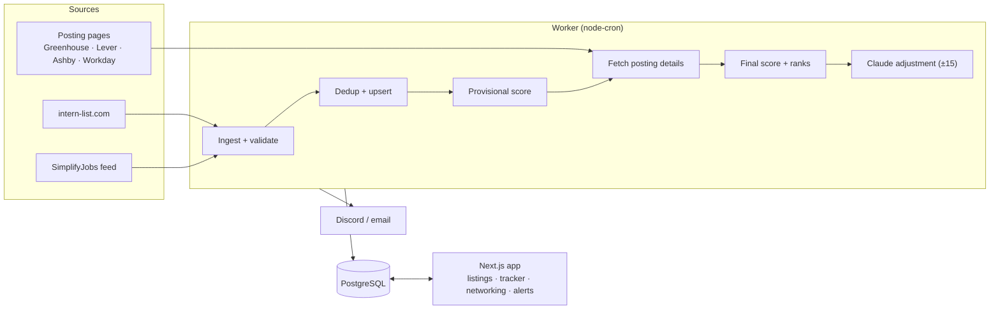

# Internship Tracker

A self-hosted web app that collects software engineering internship postings from several public sources, removes duplicates, ranks each one 0–100 against my own profile, and tracks my applications and networking from first contact to offer.

I built it for my own Summer 2027 search. It runs on my home server behind Traefik and Authelia, with one container for the web app and one for a scheduled background worker.

**Stack:** Next.js 16 (App Router) · React 19 · TypeScript · Tailwind CSS v4 · Prisma 7 · PostgreSQL · node-cron · Vitest · Docker

> **Scope.** The app finds, ranks and organizes. It never applies to jobs, fills in forms, sends email or stores credentials for job sites. Every application and message is done by hand.

---

## Features

**Listings**
- Pulls new postings every day from the [SimplifyJobs](https://github.com/SimplifyJobs/Summer2027-Internships) listings feed and from intern-list.com.
- Removes duplicates of the same posting across sources. Two postings with different requisition IDs or URLs are never merged, so a real role can't be hidden by a wrong match. Every merge is recorded and can be undone from the UI.
- For the most promising listings, fetches the full posting from the applicant tracking system (dedicated parsers for Greenhouse, Lever, Ashby and Workday, plain text extraction for anything else) to get the description and application deadline. Fetching is rate-limited and follows `robots.txt`.
- Marks a listing as likely closed once it disappears from every source. Listings are never deleted.

**Ranking**
- **Stage 1** is deterministic. It weighs tech-stack fit, role type, company tier, location, freshness and deadline urgency, all configured in [`config/scoring.json`](config/scoring.json). Changes to that file apply on the next scoring run without a restart.
- **Stage 2** is optional. Claude reads the full posting text of high-scoring listings and adjusts the score by at most ±15 points. Results are cached against a hash of the posting text, so each posting is assessed once, and listings without text are never sent.
- Each score comes with a full breakdown, and the table shows rank changes only when the listing's own score changed.

**Application tracking**
- Kanban and list views, a status history for each application, notes, and a dashboard.
- Bulk import from pasted text or CSV, and CSV export.
- Roles found outside the sources can be added by hand.

**Resume matching**
- Upload a PDF resume and see which keywords from each posting it covers and which it misses.

**Networking**
- A contact list linked to companies, shown in context on listings ("People at Stripe") and on tracker cards.
- An outreach log: openers, LinkedIn connection requests, replies and meetings.
- Each contact's status and next follow-up date are derived from that log on a configurable business-day schedule.
- Records which contact referred me for which application.
- Imports LinkedIn's `Connections.csv` export.
- Claude can draft cold emails, LinkedIn notes, follow-ups and thank-you messages, matching my writing style from my past edits. The app only drafts: I copy the text or open it in my own mail client.

**Alerts**
- A daily digest of new high-scoring roles and follow-ups that are due, a "closing soon" alert for saved listings, and a high-score alert after each refresh.
- Alerts go to Discord and email, and each one is sent only once.

**Interface**
- A dense, virtualized table with filters, keyboard navigation (`j`/`k`, `/` to search, `?` for help), a detail panel, a context menu and a dark theme.

---

## Architecture



Each refresh runs as one ordered cycle ([`lib/cycle.ts`](lib/cycle.ts)). Most sources provide no description text, so a cheap provisional score first decides which postings are worth fetching in full, rather than fetching every posting page in the catalog.

### Design decisions

- **Sources are pluggable adapters.** Each one returns Zod-validated listings. Adding a source means one adapter file and one registry entry, with no migration. One source failing never stops the others.
- **The dedup logic would rather miss a duplicate than make a wrong merge.** Matching is exact on a normalized company, title and location key, then fuzzy on title within the same company and location. A different requisition ID or URL (host, path and query) always blocks a merge.
- **All external data is untrusted.** Source payloads, CSV imports, PDF text and model output are validated with Zod at the boundary, and scraped HTML is sanitized before rendering.
- **Raw fetches are stored.** Each ingest run keeps its raw payload, compressed, for a set retention period, so a parser regression can be compared against the real input.
- **Scores are reproducible.** Stage 1 is a pure function of the listing and a hashed config. Stage 2 runs at temperature 0 and is cached per posting.
- **Two separate paths to Claude.** Scoring uses the Anthropic API with an API key. Networking drafts use the Claude Agent SDK with every tool, plugin and settings source disabled: one turn, a temporary isolated home directory, and an allowlisted environment.
- **Auth is delegated.** Authelia handles sign-in as Traefik forward-auth. The app checks the forwarded identity against a single-user allowlist that admits no one if unset. Every Server Action checks the session again, and a test finds every action file automatically, so a new unguarded action fails the test suite.

Full details are in [`docs/ARCHITECTURE.md`](docs/ARCHITECTURE.md): the data model, invariants, how rescoring is triggered, and where every setting lives.

---

## Testing

The project has more than 1,100 [Vitest](https://vitest.dev) tests, covering:
- source parsers, run against real captured payloads in [`tests/fixtures/`](tests/fixtures/);
- deduplication, scoring, the follow-up schedule, alert building and CSV import;
- integration tests against a real Postgres schema;
- UI components.

Tests never touch the network. Integration tests run only against a database explicitly marked for testing, and refuse to run against anything else.

```bash
npm test          # full suite
npm run lint      # ESLint
```

---

## Running locally

Requires Node.js 22+ and PostgreSQL.

```bash
npm ci
cp .env.example .env      # set DATABASE_URL (with ?schema=public) and ALLOWED_USER
npx prisma migrate dev    # create the schema
npm run dev               # app on http://localhost:3000
npm run worker            # scheduled ingestion, scoring and alerts
```

[`.env.example`](.env.example) documents every variable. Claude features are optional: without API credentials, scoring uses stage 1 only and drafting is turned off.

Outside the production setup there is no Authelia in front of the app, so every request must carry the identity header (`Remote-Email`) matching `ALLOWED_USER`. A small local proxy that adds it is the easiest way.

## Deployment

The app is deployed as two services on an existing Docker Compose stack behind Traefik:
- one Docker image runs both the web app and the worker;
- a backup sidecar runs scheduled `pg_dump`s and verifies each dump before keeping it.

A systemd timer on the host pulls new commits on `main`. For each one it backs up the database, builds, waits for the health checks, and rolls back automatically if they fail. See [`docs/DEPLOYMENT.md`](docs/DEPLOYMENT.md).

---

## Project layout

```
app/          Next.js routes: listings, tracker, import, resume, alerts, network
lib/          ingestion, scoring, applications, resume, alerts, networking, auth
worker/       scheduled jobs and the internal /refresh endpoint
prisma/       schema and migrations
config/       scoring weights, keywords and thresholds
tests/        mirrors lib/; fixtures/ holds captured source payloads
deploy/       Compose services and env template for the host stack
scripts/      backup, restore and backup health check
docs/         architecture, deployment and the networking design
```

---

## License

[MIT](LICENSE) © 2026 Jayden Mistry
