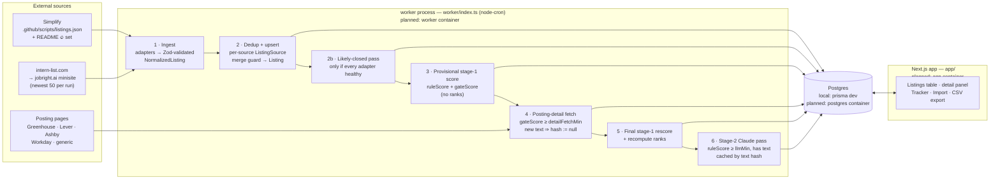
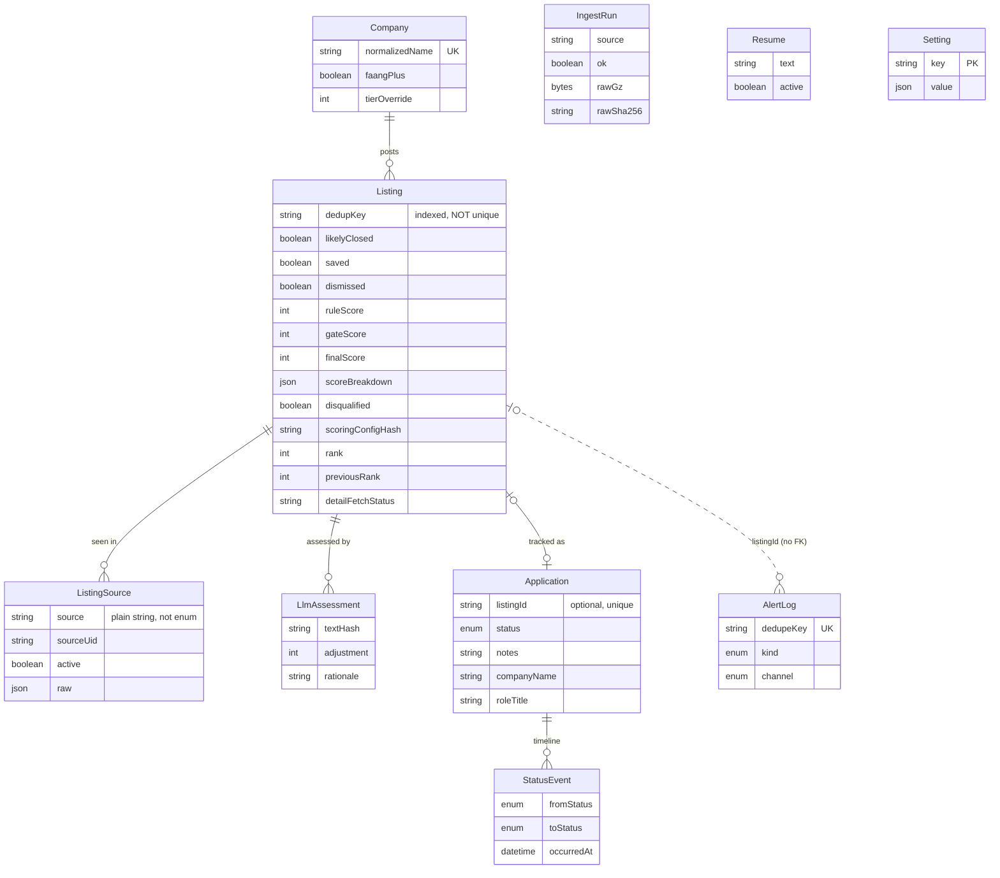

# Architecture

How the internship tracker actually works, written from the code as it exists
(through Phase 3). Where the original plan in `CLAUDE.md` describes something
that isn't built yet, or was built differently, this document says so — see
[Plan vs. reality](#plan-vs-reality) first if you're orienting.

---

## Data flow

One **cycle** (`lib/cycle.ts`, `runFullCycle`) runs the whole pipeline. It is
triggered by the worker's cron schedule (`INGEST_CRON`, default 06:00 daily) or
by `POST /refresh` on the worker's internal HTTP port — though nothing in the UI
calls that endpoint yet (see [Plan vs. reality](#plan-vs-reality)).



**Containers do not exist yet.** Deployment (Dockerfile, compose, Traefik) is
Phase 5. Today everything runs as local processes: `npm run dev` (app),
`npm run worker` (worker), and `npx prisma dev` (Postgres). The subgraph labels
show where each stage runs now and which container it is planned to move into.

### Why the stages are ordered this way

Most sources ship no description text, and tech fit — the heaviest scoring
component — needs text. Fetching every posting page would be thousands of
requests, so a cheap **provisional** score picks which pages are worth
fetching, then the **final** pass rescores exactly the listings that gained
text. The provisional pass gates on **`gateScore`**, which is the same weighted
score with tech fit *excluded from the denominator*. Gating on the displayed
score deadlocked the pipeline: no text → tech fit 0 → below the gate → never
fetched → no text. At one point only 22 of ~2,860 listings had ever been fetched.

---

## Data model



`IngestRun`, `Resume` and `Setting` have no relations. `AlertLog.listingId` is a
plain string with no foreign key.

### Models and their invariants

**Company** — one row per normalized company name.
- `normalizedName` is unique; listings attach by it.
- `faangPlus` is only ever *raised* by source data (the Simplify README 🔥 set),
  never lowered, so a company dropping out of the README doesn't lose its tier.
- `tierOverride` beats `faangPlus` in scoring. There is no UI to set it yet.

**Listing** — one canonical row per deduped job posting.
- **Never deleted.** A listing absent from every source is flagged
  `likelyClosed`. That flag is only set when *every* adapter reported success
  and there were zero per-item ingest failures, so a source outage or an ingest
  bug can't mass-close the catalog.
- `dedupKey` (`normalized company | normalized title | location bucket`) is
  **indexed but not unique** — distinct requisitions legitimately share it.
- **Merge guard:** two records whose requisition id, or same-host canonical URL,
  differ are never merged, whatever the fuzzy title score says. Multiple
  surviving candidates means *create*, not guess. Every merge is recorded in
  `mergedFrom`. There is no UI to split a bad merge yet (see Plan vs. reality).
- The scoring snapshot (`ruleScore`, `gateScore`, `finalScore`,
  `scoreBreakdown`, `disqualified`, `disqualifyReasons`) is rewritten by every
  stage-1 pass. A disqualified listing keeps its full breakdown but scores 0.
- `rank` is assigned at the end of each final scoring pass; null when
  disqualified. `previousRank` / `rankChangedAt` change **only** when rank
  actually changes, so "moved yesterday" stays true through later no-op runs.
- `saved` / `dismissed` are user flags. Dismissal survives refreshes.

**ListingSource** — one row per (source, source-native id).
- `(source, sourceUid)` is unique — this, not `dedupKey`, is row identity.
- `source` is a plain string so adding an adapter needs no migration.
- `raw` holds the latest raw record from that source.

**IngestRun** — one row per adapter per cycle.
- The raw payload is persisted **before parsing** (adapters call
  `ctx.saveRaw`), so a parser crash still leaves the payload to debug.
- An identical consecutive payload stores only `rawSha256` (`rawGz` null).
- Payloads older than `RAW_RETENTION_DAYS` have `rawGz` nulled; the row stays.

**LlmAssessment** — the stage-2 cache.
- `(listingId, textHash)` is unique. Only the assessment matching the listing's
  **current** `postingTextHash` applies; older ones are ignored, never re-billed.
- The adjustment is clamped to `±llm.maxAdjustment` (15) regardless of what the
  model returns. None exist yet — `ANTHROPIC_API_KEY` has never been set.

**Application** — the user's tracking record.
- `listingId` is optional and unique: a listing has at most one application,
  and **manual** applications (roles found outside the sources) have none.
- `companyName` / `roleTitle` / `location` are kept even when linked, so an
  unlink or a bad upstream merge never loses what the user typed.
- `appliedAt` records the **first** submission. Moving back to `APPLIED` (an
  accidental OA corrected, or un-apply then re-apply) never overwrites it.
- **"Not applied" has two representations** — this differs from the original
  plan, which said "absence of a row". It is *either* no row, *or* a row with
  status `NOT_APPLIED` that exists only to hold notes written before applying.
  Un-applying a listing whose application has notes keeps the row rather than
  deleting the notes. Readers must treat both the same: the table folds null
  into `NOT_APPLIED`; the tracker and dashboard exclude `NOT_APPLIED` rows.

**StatusEvent** — append-only status timeline.
- `recordStatus` writes nothing for a no-op transition, so every event is a
  real change.
- Events are deleted only together with their application (un-applying a
  listing that has no notes).

**Resume** — extracted resume text for keyword matching.
- Latest `active` row wins. **Nothing writes this table yet** — PDF upload is
  Phase 4. The detail panel reads it and shows a "no resume" state until then.

**Setting** — key/value JSON for UI-editable config. **Unused so far**;
intended for Phase 4 alert thresholds.

**AlertLog** — alert de-duplication (`dedupeKey` unique). **Unused so far**;
alerts are Phase 4.

---

## How rescoring is triggered

The part most likely to be forgotten. Stage 1 (`runStageOne` in
`lib/scoring/rescore.ts`) rescores a listing when **any** of these hold:

| Condition | What causes it |
|---|---|
| `scoringConfigHash` is null | A listing marked its own score stale (below) |
| `scoringConfigHash` ≠ current hash | `config/scoring.json` changed, **or** the engine version was bumped |
| `scoredAt` is null | Never scored |
| `scoredAt` older than `RESCORE_MAX_AGE_HOURS` (default 20) | Time passed |

**The current hash is `v{SCORING_ENGINE_VERSION}-{sha256(config)}`.**
- The config part is recomputed on *every* scoring run — the file is re-read
  each time, never cached — so editing weights needs no restart and triggers a
  full rescore on the next run. Key order and whitespace don't count; content does.
- `SCORING_ENGINE_VERSION` (currently **3**, in `lib/scoring/engine.ts`) must be
  **bumped by hand whenever scoring logic changes**. Without it, a code deploy
  that changes scores would rescore nothing — the config hash can't see code.
  Forgetting is survivable: the max-age reclaim rescores everything within a day.

**Self-invalidation — `scoringConfigHash := null`.** A listing marks its own
score stale, with no extra bookkeeping, when:
- the detail fetch yields richer posting text,
- the detail fetch finds a **changed** deadline (an unchanged one doesn't count),
- an adapter supplies richer posting text on ingest,
- a `likelyClosed` listing reappears in a source (reopened),
- an adapter supplies a changed deadline,
- the likely-closed pass flags it (this is what makes the "posting closed"
  disqualifier fire for listings that close *after* first being scored).

**Max-age reclaim.** `freshness` decays with time and `deadlineUrgency` opens
and closes, so a purely hash-gated pass would freeze both at first-score time.
Any row not scored within `RESCORE_MAX_AGE_HOURS` is reclaimed. Under the daily
cron that is one full pass per day. Scoring itself is fast; the cost is the
per-row writes — a full pass over ~2,900 listings measured **~90 seconds**
against the local `prisma dev` database. Writes go in 50-row transactions, and
a chunk that fails is retried row by row, so a slow moment or a bad row never
aborts the pass (an earlier 200-row transaction ran past Prisma's 5-second
limit and threw out of the whole rescore). A row that still fails keeps its
stale hash and is picked up next pass.

**Rank churn is expected.** Because rank is positional, one listing's score
moving by a single point shifts every listing it passes by one place — a daily
pass moves some ranks even when those listings didn't change themselves (two
forced passes minutes apart moved 8 and 31).

**Stage 2** runs after stage 1 on listings that are not disqualified, dismissed
or closed, have `ruleScore ≥ thresholds.llmMin`, and **have posting text**
(never a title-only call). Stage 1 resets `llmAdjustment` on every rescore;
stage 2 then re-applies it from the `(listingId, textHash)` cache at no API
cost. Calls are capped by `LLM_MAX_CALLS_PER_RUN`.

**Ranks** are recomputed at the end of every `rescoreListings` call, except the
cycle's provisional pass (`updateRanks: false`) — ranking half-scored listings
would report movement that the final pass immediately undoes.

`rescoreListings({ force: true })` rescores everything regardless; nothing in
the cycle calls it.

---

## The `prisma dev` schema trap

The local database is `npx prisma dev`, which fronts Postgres with a proxy. That
proxy has bitten this project in three distinct ways. All three fail
**silently**: queries succeed, against the wrong data.

**Form 1 — the database name is ignored.** Every database name in a connection
string routes to the same physical database. An early attempt at isolating
tests with a separate `…_test` database appeared to work while the integration
tests were wiping the real ingested listings on every run.
*Fix:* tests are isolated by Postgres **schema** (`itest`), not by database.

**Form 2 — the driver adapter ignores `?schema=`.** With Prisma 7's driver
adapters, the connection string goes to node-postgres, which drops parameters
it doesn't recognize. Adding `?schema=itest` changed nothing; tests still hit
`public`.
*Fix:* `lib/db.ts` reads `?schema=` itself and passes it to `PrismaPg`
explicitly.

**Form 3 — `search_path` leaks between connections.** A connection that doesn't
name its schema inherits whatever `search_path` the proxy last had — often
`itest`, left over from a test run. Two symptoms:
- *`prisma db push` / migrations:* a push without an explicit schema went to
  `itest`. The result is a paradox — the app says a new column doesn't exist
  while `db push` insists it already does.
- *Raw SQL:* `PrismaPg`'s schema option applies only to queries Prisma
  generates. `$executeRaw` is sent verbatim, so an unqualified `"Listing"`
  resolved through the leaked `search_path`. The first rank pass reported
  success while writing 2 rows in the test schema instead of 1,615 in the
  real one.

*Fixes:* `DATABASE_URL` always names its schema (`?schema=public`); push by
hand only with `--url` including the schema; and raw SQL never uses an
unqualified table name — it goes through `qualifiedListingTable()` in
`lib/scoring/rescore.ts`, which validates the schema as a safe identifier.

**Related, not the proxy:** after a schema migration, a running `next dev`
keeps its old generated Prisma client and fails with `Unknown field` until the
dev server is restarted. And `prisma dev` itself does not survive the shell or
session that started it — if the app shows `ECONNREFUSED`, run
`npx prisma dev start default` (the data persists).

---

## Where the knobs live

**`config/scoring.json` — no restart.** Re-read and hashed on every scoring
run. Any content change rescores the whole catalog on the next run.
- `weights` — relative weight per component.
- `techFit.skills` — your skills, their points and match patterns. Also the
  first part of the resume-matching vocabulary.
- `roleType.classes` — ranked role classes; **first match wins, array order is
  specificity, not value**. Reorder to retune.
- `companyTier`, `location`, `freshness` (half-life), `deadlineUrgency` (window).
- `disqualifiers` — advanced degrees (with the bachelor's exemption),
  blocked countries, closed.
- `thresholds.detailFetchMin` — **measured on `gateScore`**, not the displayed
  score. Currently 50. Raise it if fetch volume becomes a problem.
- `thresholds.llmMin` — measured on `ruleScore`. Currently 70.
- `llm.*` — enabled, model, max adjustment, text/rationale/token caps.

**`SCORING_ENGINE_VERSION` in `lib/scoring/engine.ts` — code, needs a deploy.**
Bump it when scoring logic changes (see above).

**`Setting` table — no restart by design, but unused.** Reserved for Phase 4's
UI-editable alert thresholds.

**Environment variables — restart the process that reads them.** `.env` is
loaded once at process start, so every change needs a restart even for values
that are read on every call. `.env.example` documents them all.

| Variable | Read by | Purpose |
|---|---|---|
| `DATABASE_URL` | app, worker, Prisma CLI | Must include `?schema=` |
| `SHADOW_DATABASE_URL` | Prisma CLI only | `migrate dev/diff` locally |
| `INGEST_CRON` | worker | Cycle schedule |
| `WORKER_PORT` | worker | Internal `/refresh` + `/healthz` |
| `USER_AGENT_CONTACT` | worker | Contact in the scraper User-Agent |
| `RAW_RETENTION_DAYS` | worker | Raw payload retention |
| `DETAIL_REFETCH_DAYS` | worker | Re-fetch posting pages after N days |
| `DETAIL_MAX_PER_RUN` | worker | Posting fetches per cycle (default 250) |
| `SCORING_CONFIG_PATH` | worker, app | Location of `scoring.json` |
| `ANTHROPIC_API_KEY` | worker | Stage 2; unset = cache only |
| `LLM_MAX_CALLS_PER_RUN` | worker | Claude spend cap (malformed ⇒ default, never "no cap") |
| `LLM_MAX_CANDIDATES_PER_RUN` | worker | Bounds the stage-2 candidate query |
| `RESCORE_MAX_AGE_HOURS` | worker | Max-age reclaim window |

The app reads `SCORING_CONFIG_PATH` too, because the detail panel shows weights
and builds the resume vocabulary from the config.

---

## Directory map

```
app/                       Next.js App Router (UI only; no auth yet)
  page.tsx                 / — the listings table
  listings/                table, detail panel, context menu, their actions
  tracker/                 /tracker — kanban/list + minimal dashboard
  import/                  /import — paste/CSV import with match review
  api/applications/export/ GET → applications CSV (round-trips via /import)
  layout.tsx, globals.css  shell, nav, dark theme tokens (Tailwind v4, CSS config)
components/                small shared UI primitives
lib/
  db.ts                    Prisma client; passes ?schema= to the adapter
  cycle.ts                 one full refresh, stages in order
  ingestion/
    adapters/              simplify, intern-list, registry, NormalizedListing contract
    detail/                posting-page fetchers + robots/rate-limit/SSRF guard
    normalize.ts           company/title/location normalization, dedupKey, req ids
    dedupe.ts              merge decision + hard guard
    pipeline.ts            ingest, upsert, likely-closed, detail stage, pruning
  scoring/
    config.ts              loads + validates + hashes scoring.json
    engine.ts              pure stage-1 scorer + disqualifiers; SCORING_ENGINE_VERSION
    llm.ts                 stage-2 Claude call (structured output, clamped)
    rescore.ts             persistence: stage 1, stage 2, ranks, raw-SQL schema guard
  listings/                table read model, detail read model, row mutations
  applications/            import parse/match, commit, tracker + dashboard, CSV
  resume/                  keyword vocabulary + posting↔resume matching
worker/index.ts            node-cron schedule + internal HTTP (/refresh, /healthz)
prisma/                    schema.prisma + migrations
config/scoring.json        every scoring weight, pattern and threshold
tests/                     Vitest; mirrors lib/; fixtures/ are real captured payloads
  global-setup.ts          creates + syncs the itest schema
  setup-env.ts             points tests at the itest schema
docs/                      this document
.claude/agents/            subagent definitions used to build the project
```

---

## Plan vs. reality

What `CLAUDE.md`'s original plan describes, against what exists after Phase 3:

| Planned | Actual |
|---|---|
| Docker containers: app, worker, postgres | **Not built** (Phase 5). Local processes. |
| OIDC auth via `proxy.ts` | **Not built** (Phase 5). No auth; localhost only. The CSV export route exposes all applications and must be covered when auth lands. |
| `scripts/backup.sh` | **Not built** (Phase 5). |
| `lib/alerts/`, Discord + SMTP | **Not built** (Phase 4). `AlertLog` and `Setting` are unused. |
| Resume PDF upload | **Not built** (Phase 4). Matching logic and the panel section exist. |
| "Refresh now" button → worker `/refresh` | Endpoint exists; **no UI calls it**. |
| UI action to split an incorrect merge | **Not built.** `mergedFrom` records every merge, but nothing can undo one yet. |
| "Not applied" = absence of an Application row | Also a `NOT_APPLIED` row holding pre-apply notes. |
| Detail fetch gated on the score | Gated on **`gateScore`** (tech fit excluded) — the plain score deadlocked. |
| Rank derived for display | **Persisted** on Listing, with movement history. |
| intern-list HTML scrape | Parses the embedded jobright.ai minisite's `__NEXT_DATA__`; gets only the newest 50 per run because deeper pages need jobright's robots-disallowed `/api`. |
| Separate test database | Separate test **schema** (see the `prisma dev` trap). |
| Prisma (unspecified version) | Prisma 7 with the `@prisma/adapter-pg` driver adapter. |
